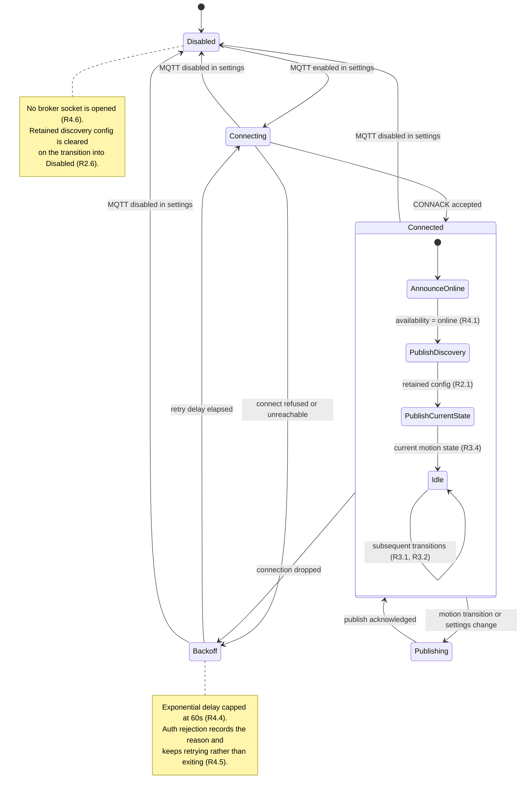

# Design: MQTT Integration for Home Assistant

<!-- spec-nav:start -->
**Spec navigation:** [State](00_state.md) · [Requirements](01_requirements.md) · [Design](02_design.md) · [Tasks](03_tasks.md) · [Execution](04_execution.md)
<!-- spec-nav:end -->

## Overview

A new `mqtt` module in the Rust web service maintains a single long-lived MQTT connection,
publishes a Home Assistant discovery configuration for one motion binary sensor, and mirrors
OctoCam's existing in-memory motion signal onto a state topic. A new admin-only
`/settings/mqtt` page configures the broker and shows live connection state.

The publisher is a **subscriber to existing state, never a source of truth.** It attaches to the
`tokio::sync::broadcast` channel that already carries motion transitions, so motion detection,
the SSE endpoint, and `/api/status` are untouched. If the publisher dies or the broker vanishes,
nothing else in OctoCam notices.

## Current technology evidence

Researched via Context7 and crate documentation rather than assumed, because both the MQTT
client API and the Home Assistant discovery schema change over time.

| Question | Source | Finding | Decision |
|---|---|---|---|
| Which Rust MQTT client? | `/bytebeamio/rumqtt` | `rumqttc` provides `AsyncClient` + `EventLoop` over tokio; the event loop drives reconnection. Pure Rust with `tokio-rustls`. | Use `rumqttc`. It needs no system packages or link configuration, unlike paho, whose C library wants pkg-config and an OpenSSL dev package that the build image does not currently install. |
| Does it support LWT and credentials? | docs.rs `rumqttc` **0.25.1** | `MqttOptions` exposes `set_last_will`, `set_credentials`, `set_keep_alive`, `set_transport`; `LastWill` is public. | Satisfies R4.2 and R1.1 directly; no custom will handling needed. |
| Discovery topic shape? | `/home-assistant/home-assistant.io` | `<discovery_prefix>/<component>/[<node_id>/]<object_id>/config`, prefix defaults to `homeassistant`. Best practice: set `<object_id>` to the `unique_id` and omit `<node_id>`. | Publish to `<prefix>/binary_sensor/<unique_id>/config`, no node id. |
| Discovery payload for a motion sensor? | `/home-assistant/home-assistant.io` | `{"name": null, "device_class": "motion", "state_topic": …, "unique_id": …, "device": {"identifiers": […], "name": …}}`. `name: null` derives the entity name from the device. | Adopt verbatim, plus availability fields below. |
| Binary sensor payloads? | `/home-assistant/home-assistant.io` | Valid states are `ON` and `OFF`; overridable via `payload_on`/`payload_off`. | Publish literal `ON`/`OFF` and omit the overrides. |
| How does availability work? | `/home-assistant/home-assistant.io` | `availability_topic` carries birth/LWT. If defined, the entity is **unavailable by default**. Multiple topics are supported via `availability` with `availability_mode` of `all`/`any`/`latest`. | Use **two** availability topics with `availability_mode: all` — see the Q3 resolution below. |

## Architecture

The publisher is a single tokio task owning the client and event loop. It reacts to three
inputs: motion transitions, settings changes, and broker connection events.



## Components and interfaces

### `rust/octocam-web/src/mqtt.rs` (new)

Owns everything MQTT. Nothing else in the codebase links against `rumqttc`.

- **`spawn_mqtt_publisher(config_path, motion_rx, motion_detected, status) -> ()`**
  Spawns the task. Mirrors the shape of `spawn_motion_detector` in
  [`rust/octocam-web/src/motion.rs`](../../rust/octocam-web/src/motion.rs) so the two read alike.
  - `motion_rx: broadcast::Receiver<bool>` — subscribed from the existing `motion_tx`.
  - `motion_detected: Arc<AtomicBool>` — read for the connect-time snapshot (R3.4).
  - `status: Arc<Mutex<MqttStatus>>` — written for the settings page.
- **`MqttStatus`** — `{ state: Disabled | Connecting | Connected, last_error: Option<String>, connected_since: Option<u64> }`.
- **`topics(settings) -> Topics`** — pure function deriving every topic string from settings. Pure so it is unit-testable without a broker.
- **`discovery_payload(settings) -> serde_json::Value`** — pure builder for the discovery JSON.

### [`rust/octocam-web/src/settings.rs`](../../rust/octocam-web/src/settings.rs) (modified)

New fields on `Settings`, all with defaults so existing settings files load unchanged:

| Field | Type | Default | Notes |
|---|---|---|---|
| `mqtt_enabled` | `bool` | `false` | R1.2 |
| `mqtt_host` | `String` | `""` | |
| `mqtt_port` | `u16` | `1883` | R1.4 clamps to 1–65535 |
| `mqtt_username` | `String` | `""` | |
| `mqtt_password` | `String` | `""` | Redacted everywhere — see security gate |
| `mqtt_tls` | `bool` | `false` | R1.6 |
| `mqtt_client_id` | `String` | `""` | Empty means derive from node id |
| `mqtt_base_topic` | `String` | `"octocam"` | Q2 resolution |
| `mqtt_discovery_prefix` | `String` | `"homeassistant"` | R1.3 |
| `mqtt_node_id` | `String` | generated | Stable identity, see below |

`public_settings` gains `map.remove("mqtt_password")` alongside the existing
`admin_password_hash` removal, and inserts `mqtt_password_set: bool` so the UI can show whether
a password exists without revealing it (R6.1, R6.2).

`validate_map` rejects an out-of-range port and an enabled-with-empty-host submission by
retaining the previously stored values (R1.4, R1.5), and preserves the stored password when the
incoming map omits `mqtt_password` (R6.3).

### [`rust/octocam-web/src/backup.rs`](../../rust/octocam-web/src/backup.rs) (modified)

`PORTABLE_FIELDS` is an allowlist, so new settings are excluded from backups unless named. Add
the broker connection fields and **deliberately omit `mqtt_password`**, so exporting a backup can
never carry the broker credential off-device.

An existing test, `field_lists_cover_all_settings`, asserts every `Settings` field appears in
either `PORTABLE_FIELDS` or `EXCLUDED_FIELDS`, so omission alone breaks the build. Both
`mqtt_password` and `mqtt_node_id` go in `EXCLUDED_FIELDS`:

- `mqtt_password` — a credential must not travel in a backup file.
- `mqtt_node_id` — it is this device's identity. Restoring a backup onto a second camera would
  otherwise carry the first camera's `unique_id` across, and two devices would claim the same
  Home Assistant entity. This matches why `homekit_paired` and `wifi_ssid` are already excluded.

### [`rust/octocam-web/src/main.rs`](../../rust/octocam-web/src/main.rs) (modified)

- `AppState` gains `mqtt_status: Arc<Mutex<MqttStatus>>` and `mqtt_reload_tx: broadcast::Sender<()>`.
- `GET /api/mqtt/status` — admin-only, returns `MqttStatus` (R5.4, R5.5).
- A shared "settings changed" helper sends on `mqtt_reload_tx` after every successful write, so
  the publisher re-reads configuration without a restart (R5.6). This must cover **all four**
  writers, not just the settings `PUT`: `api_settings_update`, `api_restore`, `api_setup_post`,
  and `api_time_sync` all call `settings::save_settings` directly. Restore matters most — because
  the non-secret MQTT fields are in `PORTABLE_FIELDS`, a restored backup can change broker
  settings, and without the signal the publisher would keep using the old configuration until the
  service restarted.

### Frontend

- `frontend/src/routes/MqttSettings.tsx` — the form, following the `MotionSettings` shape
  established in this repo: local form state, its own save, dirty reporting through
  [`frontend/src/hooks/useUnsavedChanges.ts`](../../frontend/src/hooks/useUnsavedChanges.ts) (R5.7).
- `mqtt` added to `ADMIN_ONLY_SETTINGS_SLUGS` in [`frontend/src/lib/nav.ts`](../../frontend/src/lib/nav.ts)
  and to `ADMIN_ONLY_PAGES` in [`frontend/src/App.tsx`](../../frontend/src/App.tsx). Because that
  map is a total `Record` over the slug union, adding the slug without the page is a compile
  error, which is what enforces R5.2 and keeps the sidebar in step.
- Sidebar entry using the already-vendored `MqttIcon` in
  [`frontend/src/components/icons/selfhst.tsx`](../../frontend/src/components/icons/selfhst.tsx).

## Data model: topics and payloads

With defaults and node id `a1b2c3`:

| Purpose | Topic | Retained | Payload |
|---|---|---|---|
| Discovery | `homeassistant/binary_sensor/octocam_a1b2c3_motion/config` | yes | discovery JSON below |
| Motion state | `octocam/a1b2c3/motion/state` | yes | `ON` / `OFF` |
| Service availability | `octocam/a1b2c3/availability` | yes | `online` / `offline` |
| Detection availability | `octocam/a1b2c3/motion/availability` | yes | `online` / `offline` |

```json
{
  "name": null,
  "device_class": "motion",
  "unique_id": "octocam_a1b2c3_motion",
  "state_topic": "octocam/a1b2c3/motion/state",
  "availability_mode": "all",
  "availability": [
    { "topic": "octocam/a1b2c3/availability" },
    { "topic": "octocam/a1b2c3/motion/availability" }
  ],
  "device": {
    "identifiers": ["octocam_a1b2c3"],
    "name": "<device_name from settings>",
    "manufacturer": "OctoCam",
    "model": "Raspberry Pi Camera"
  }
}
```

**Node identity.** `mqtt_node_id` is generated once on first save and persisted, giving a
stable `unique_id` across restarts, device renames, and IP changes (R2.3). Deriving it from the
device name would break the entity every time the name changed; deriving it from a MAC or IP
would break on hardware or network change.

## Resolution of the open questions

**Q1 — password at rest: store plaintext, restrict every exit path.** *Revisit this at the
delivery checkpoint — it is the one decision here that is a security posture rather than a
mechanical consequence.* The settings file is
root-owned on a single-tenant device, and anyone who can read it can already read
`admin_password_hash` and rewrite the whole configuration. Encrypting it would require a key
stored on the same disk, which is theatre rather than protection. The design instead closes
every path off the device: redacted from the API (R6.1), absent from backups, and never logged
(R6.5). **This is a recommendation, not a settled decision — flag it at the gate if you want
at-rest encryption or an external secret file instead.**

**Q2 — base topic prefix: fixed literal `octocam`, with the node id as the second segment.**
A name-derived prefix would move every topic when the camera is renamed, orphaning retained
messages under the old prefix. The prefix stays editable for anyone with an existing topic
convention.

**Q3 — motion detection disabled: report unavailable, do not remove.** Implemented with the
second availability topic and `availability_mode: all`. Removing the entity would make Home
Assistant forget its automations and history; unavailable preserves both while making it
obvious the camera is not watching (R3.5). This also keeps the Home Assistant view consistent
with the dashboard indicator, which already distinguishes "off" from "clear".

## Error handling

| Condition | Behavior | Requirement |
|---|---|---|
| Broker unreachable | Backoff doubles from 1s to a 60s ceiling; the task never exits | R4.4 |
| Credentials rejected | Reason recorded in `MqttStatus.last_error`, retry continues at the ceiling | R4.5 |
| Connection drops mid-publish | Event loop surfaces the disconnect; state returns to Backoff; state republished on reconnect | R3.4, R4.4 |
| TLS handshake fails | Treated as a connect failure; never retried without TLS | R1.6 |
| Invalid port or empty host on save | Submission rejected, stored config unchanged | R1.4, R1.5 |
| MQTT disabled while connected | Clear retained discovery, publish `offline`, disconnect | R2.6, R4.3 |
| Publish channel lagged | `broadcast::Receiver` lag is recovered by publishing current state from the `AtomicBool` rather than replaying missed transitions | R3.4 |

## Cross-cutting gates

| Gate | Assessment |
|---|---|
| **Security / authorization** | Broker password is the sensitive asset. Failure modes: leaking it via API, logs, or backup. The likeliest log leak is not a literal `mqtt_password` in a format string but a `Debug`-derived dump of the whole settings struct or of `MqttOptions`, so verification asserts on `Debug` output rather than grepping for the field name. Publish-only means no inbound control path. |
| **Privacy** | Motion state leaves the device for the first time. It is a boolean, not imagery — no frames, snapshots, or zone geometry are published. Off by default (R1.2). |
| **Performance** | One connection, one task, publishes only on transition. Negligible next to the ffmpeg pipelines. Relevant because the Pi is already CPU-tight: measured at load ~1.9–6 during this project's work. |
| **Observability** | `MqttStatus` surfaced at `/api/mqtt/status` and on the settings page (R5.4, R5.5); connect/disconnect logged at info, failures at warn, never including credentials. |
| **Migration** | Additive settings fields with defaults; existing settings files load unchanged. No schema migration. |
| **Rollout** | Disabled by default, so deploying this changes nothing until an admin opts in (R7.5). |
| **Rollback** | Reverting the binary leaves retained topics on the broker. Documented as a known consequence; disabling MQTT before rollback cleans them (R2.6). |
| **Accessibility** | The settings form uses the existing Label/Input/Switch components already used by other settings pages, so it inherits their labelling and keyboard behaviour. |

## Testing strategy

- **Unit, no broker required:** `topics()` and `discovery_payload()` are pure, so topic
  construction, prefix handling, the `availability_mode: all` pair, and `device_class: motion`
  are all assertable directly. Settings validation and redaction likewise.
- **Redaction:** assert `public_settings` output contains no `mqtt_password` key and that
  `build_backup` output omits it.
- **Integration against a real broker:** run Mosquitto locally, subscribe with `mosquitto_sub`,
  and assert the retained discovery config, the `ON`/`OFF` transitions, the birth message, and
  the LWT after an ungraceful kill.
- **On-device:** enable against the user's real Home Assistant broker and confirm the entity
  auto-appears, tracks motion, and greys out when OctoCam stops.

## Correctness properties

1. Broker settings persist across a restart with defaults applied to absent fields. **Validates: Requirements 1.1, 1.2, 1.3**
2. A submission with an out-of-range port or an enabled-but-hostless configuration leaves stored settings byte-identical. **Validates: Requirements 1.4, 1.5**
3. With TLS enabled, the connection is attempted over TLS only, and a handshake failure produces a retry rather than a plaintext attempt. **Validates: Requirements 1.6**
4. On connect, a retained discovery config is published under the configured prefix at `<prefix>/binary_sensor/<unique_id>/config`, carrying `device_class: motion`, a restart-stable `unique_id`, a `device` block naming the camera, and references to the state and availability topics. **Validates: Requirements 2.1, 2.2, 2.3, 2.4, 2.5**
5. Disabling MQTT clears the retained discovery config, so Home Assistant drops the entity rather than showing it permanently unavailable. **Validates: Requirements 2.6**
6. Renaming the device republishes the discovery config with the new name. **Validates: Requirements 2.7**
7. Each motion transition publishes exactly one retained `ON` or `OFF` to the state topic, within 2 seconds of the transition. **Validates: Requirements 3.1, 3.2, 3.3, 3.6**
8. On connect or reconnect, current motion state is published without waiting for a transition. **Validates: Requirements 3.4**
9. While motion detection is disabled, the detection availability topic reads `offline`, and with `availability_mode: all` the entity is unavailable in Home Assistant regardless of the last state payload. **Validates: Requirements 3.5**
10. Connecting publishes retained `online` to the service availability topic; an ungraceful termination results in `offline` via the registered will; a clean shutdown publishes `offline` explicitly. **Validates: Requirements 4.1, 4.2, 4.3**
11. Repeated connection failures retry with backoff that never exceeds one attempt per 60 seconds, and an authentication rejection records a reason while continuing to retry. **Validates: Requirements 4.4, 4.5**
12. While MQTT is disabled, no TCP connection to the configured broker is ever opened. **Validates: Requirements 4.6**
13. `/settings/mqtt` renders for an administrator, is unreachable for a non-administrator, and the corresponding API rejects non-admin callers. **Validates: Requirements 5.1, 5.2, 5.3**
14. The page reports connected, disconnected, or disabled, and surfaces the latest failure reason while failing. **Validates: Requirements 5.4, 5.5**
15. Saving a changed configuration takes effect without restarting the service. **Validates: Requirements 5.6**
16. Editing the MQTT form raises the shell's unsaved-changes indicator, and saving clears it. **Validates: Requirements 5.7**
17. No API response body and no log line contains the broker password, including any `Debug`-formatted dump of settings or client options; the settings page shows only whether one is set. **Validates: Requirements 6.1, 6.2, 6.6**
18. Saving without supplying a password preserves the stored one; explicitly clearing it stores an empty password, and with no password stored the publisher connects without credentials. **Validates: Requirements 6.3, 6.4, 6.5**
19. With the broker unreachable, the web UI, streams, API, and motion detection all behave as they do with MQTT disabled. **Validates: Requirements 7.1, 7.2**
20. `/api/motion/events` and `/api/status.motion_detected` produce identical output with MQTT enabled and disabled. **Validates: Requirements 7.3**
21. HomeKit and Matter behaviour is unchanged by MQTT being enabled, and with MQTT disabled the service behaves exactly as it did before this feature. **Validates: Requirements 7.4, 7.5**

## Alternatives considered

- **`paho-mqtt`** — mature, but wraps a C library that expects pkg-config and an OpenSSL
  development package, neither of which the build image installs today. Note the build is **not**
  free of C: [`rust/octocam-web/Cargo.toml`](../../rust/octocam-web/Cargo.toml) already uses
  `rusqlite` with the `bundled` feature, which compiles SQLite's C amalgamation, and
  [`scripts/build-pi-web.sh`](../../scripts/build-pi-web.sh) runs a native `arm64` container that
  has a working compiler. The objection to paho is added system dependencies, not C itself.
  Rejected on that narrower ground.
- **Publishing from the HomeKit Node bridge** — it already runs as a separate service, but the
  motion signal lives in the Rust process, so this would need a new IPC hop and would tie MQTT
  availability to HomeKit being enabled. Rejected.
- **Single availability topic** — simpler, but then "detection disabled" is indistinguishable
  from "no motion", which is the exact ambiguity R3.5 exists to remove. Rejected.
- **Publishing per-zone entities** — deferred, not rejected. The zone mask is available, but 64
  entities would clutter Home Assistant and the requirements scope this iteration to aggregate
  motion (A4).
