# Discovery: rpiCameraSecondary as the Motion-Detection Source

<!-- spec-nav:start -->
**Spec navigation:** [State](00_state.md) · [Discovery](01_discovery.md) · [Requirements](02_requirements.md) · [Design](03_design.md) · [Tasks](04_tasks.md) · [Execution](05_execution.md)
<!-- spec-nav:end -->

## Problem and Outcome

OctoCam's motion detector reads the full-resolution `main` H264 stream and downscales it
itself (`ffmpeg -vf fps=5,scale=80:60,format=gray`,
[`motion.rs:293-325`](../../rust/octocam-web/src/motion.rs)). Every reconnect pays the cost of
a hardware H264 decoder cold-start: measured RTSP-startup times of 7.0-8.9s
([`motion.rs:20-22`](../../rust/octocam-web/src/motion.rs)), during which the camera is blind
to motion (the exact gap [commit `7ee3912`](../../CHANGELOG.md) taught the system to measure
honestly, not shrink).

mediamtx's `rpiCameraSecondary` feature exposes a second, hardware/ISP-generated stream from
the same physical camera — MJPEG by default
([mediamtx docs, "Configure Secondary Stream"](https://github.com/bluenviron/mediamtx/blob/main/docs/3-publish/14-raspberry-pi-cameras.md),
verified via Context7 `/bluenviron/mediamtx`), which is intra-only and should reconnect far
faster than an inter-coded H264 stream. This was hardware-tested previously and worked, except
mediamtx crashed on startup 3/3 times whenever a secondary rpiCamera stream was configured — a
known upstream regression,
[bluenviron/mediamtx#6060](https://github.com/bluenviron/mediamtx/issues/6060), fixed by
[PR #6061](https://github.com/bluenviron/mediamtx/pull/6061) (commit `8e46f37`). A scheduled
watcher routine this session confirmed the fix has now shipped in tagged release **v1.20.1**
(2026-08-18) — verified two independent ways: the release changelog text, and a commit-ancestry
check (`compare/8e46f37...v1.20.1`: `ahead_by 38`, `behind_by 0`, i.e. the fix commit is
contained in the tag).

**Outcome:** shrink the camera's real motion-blind window on reconnect by giving the motion
detector a near-instant-reconnect source, without reopening the CPU-starvation regression that
made motion move off `sub` in the first place, and without weakening the mediamtx-crash safety
margin that blocked this exact feature until now.

> [!NOTE]
> The "~78% CPU, ~2.6s warm reconnect" baseline numbers quoted when this work was scheduled
> could not be traced to any measurement in this repository (checked
> [`CHANGELOG.md`](../../CHANGELOG.md), [`docs/`](../../docs), this feature's own
> [`.specs/`](../../.specs) folder, and git log). Treat them as **unverified** — the only
> in-repo numbers are the 7.0-8.9s cold RTSP-startup measurements above. Requirements should
> cite a freshly measured baseline, taken on the actual device, not these numbers.

## Users and Current Workaround

- **The motion detector itself** (`octocam-web`'s `spawn_motion_detector`,
  [`motion.rs:232-575`](../../rust/octocam-web/src/motion.rs)) — the sole intended new consumer
  of the secondary stream.
- **Existing consumers of the current secondary slot** (`sub`, today hardware-H264, not
  MJPEG): the Matter/HomeKit bridge, which defaults to `sub` for live view and JPEG snapshot
  capture ([`matter.rs:255-256,362`](../../rust/octocam-web/src/matter.rs),
  [`camera.rs:16-22`](../../rust/octocam-web/src/camera.rs)); the web UI's own live-view player
  ([`main.rs:2090-2103`](../../rust/octocam-web/src/main.rs),
  [`StreamSettings.tsx:42-58`](../../frontend/src/routes/StreamSettings.tsx)); and the
  viewer-count/reader-reservation accounting
  ([`streams.rs:65`](../../rust/octocam-web/src/streams.rs),
  [`mediamtx.rs:142-149`](../../rust/octocam-web/src/mediamtx.rs)).
- **Current workaround (status quo):** motion reads `main` and eats the full cold-start
  latency on every reconnect. This is safe but slow to recover visibility after any drop.

## Scope and Non-Goals

**In scope:**
- Making the hardware `rpiCameraSecondary` MJPEG stream usable as motion's frame source when
  the conditions under which it actually exists as a hardware stream are met.
- Fixing the mediamtx config generator's codec choice for the secondary path (currently
  hardcoded to `rpiCameraCodec: hardwareH264` even when `secondary: true`, which the docs say
  should be `auto`/MJPEG for a secondary stream — see Approaches below).
- A same-Pi feasibility test: confirm no startup crash across repeated restarts on v1.20.1+,
  and measure real time-to-first-frame / CPU cost against the current `main`-based baseline.
- Deciding, and building, the fallback behavior for the (common, default) cases where the
  hardware secondary slot isn't available to motion.

**Out of scope (non-goals):**
- Touching HKSV recording, the `main` H264 encoding path, or anything Matter/HomeKit-facing
  beyond the read-only fact that they already share the secondary slot.
- An automatic, health-check-driven source failover between `main` and secondary (see
  Approaches — rejected as unneeded complexity for this iteration).
- Supporting more than one physical camera (`rpiCameraCamID`) or more than one secondary
  stream per camera — mediamtx does not support the latter at all (see Constraints).
- Upgrading mediamtx itself as part of this feature's code — the version floor
  (`>= v1.20.1`) is a deployment/verification prerequisite, tracked as an open decision below,
  not a code change in this repo.

## Constraints and Success Measures

**Constraints (grounded, not assumed):**
- **mediamtx supports exactly one secondary stream per physical camera.** Its own docs model
  one `rpiCameraCamID` with one primary path and one `rpiCameraSecondary: true` path — never
  more than one secondary — and a second physical camera would need its own `rpiCameraCamID`
  (verified via Context7 `/bluenviron/mediamtx`, "Configure Multiple Cameras" /
  "Configure Secondary Stream"). OctoCam already occupies that one secondary slot with the
  `sub` path.
- **The secondary slot is only a hardware MJPEG stream under existing conditions.**
  [`mediamtx.rs:165-192`](../../rust/octocam-web/src/mediamtx.rs) shows `sub` only gets
  `rpiCameraSecondary: true` (the hardware path) when `settings.text_overlay_enabled` is
  `false`; when overlay is on, `sub` instead runs a software ffmpeg `runOnDemand` transcoder
  (`mediamtx_scaled_path`) — the exact software-encoder path whose CPU cost caused motion to
  move off `sub` originally. `text_overlay_enabled` defaults to `false`
  ([`settings.rs:256`](../../rust/octocam-web/src/settings.rs)), so the hardware secondary is
  the common case, not the exception, but it is not guaranteed.
- **Reader capacity is already reserved.** `reserve` already adds
  `i32::from(settings.motion_enabled)` to `maxReaders` on both `main` and `sub`
  ([`mediamtx.rs:142-149`](../../rust/octocam-web/src/mediamtx.rs)) — motion becoming a `sub`
  reader needs no reader-capacity change.
- **ffmpeg's input handling is already codec-agnostic.** Motion's existing pipeline
  (`-i <url> -vf fps=5,scale=80:60,format=gray -f rawvideo -`) does not assume H264; MJPEG
  input should be a drop-in replacement for the same command.
- **Untested, one-way-ish risk:** whether the Pi Zero 2 W's ISP/CSI pipeline handles a
  simultaneous hardware-H264 primary + MJPEG secondary output as cleanly as the mediamtx-level
  crash fix suggests. This is exactly what the feasibility test must establish before any
  further design work is trusted.

**Success measures:**
1. Zero startup panics across >= 10 consecutive `octocam-rtsp` restarts with the secondary
   MJPEG path configured (the original bug crashed 3/3 times; this is the regression bar).
2. A freshly measured time-to-first-frame and CPU-cost comparison, motion-on-`main` vs.
   motion-on-secondary, on the actual device — not the unverified 78%/2.6s figures above.
3. No observable regression for existing `sub` consumers (Matter live view/snapshot, web UI
   live view) when motion also reads the same path.
4. When the hardware secondary conditions aren't met (`sub` disabled, or text overlay on),
   motion continues to work exactly as it does today (fallback to `main`), with no silent
   loss of motion detection.

## Approaches Considered

| Approach | Benefits | Costs / risks | Reversibility | Decision |
|---|---|---|---|---|
| **A. Conditional reuse of the existing `sub` secondary slot** — point motion at `sub_rtsp_path` whenever `sub_stream_enabled && !text_overlay_enabled` (the exact condition under which `sub` is already the mediamtx hardware secondary path today), fall back to `main` otherwise; fix `mediamtx_camera_path`'s codec for the secondary case from hardcoded `hardwareH264` to the docs-recommended `auto` (+ `rpiCameraMJPEGQuality`) | No new mediamtx path/settings surface; matches the existing Matter precedent of switching `stream_source` on the same two settings ([`matter.rs:593-634`](../../rust/octocam-web/src/matter.rs)); reader capacity already reserved; automatic, safe fallback to the already-working path | Motion's source becomes conditional on two settings whose primary purpose is unrelated to motion (viewer bandwidth, text overlay) — a user could unknowingly change motion's latency by toggling `sub_stream_enabled`; still needs the on-device feasibility test to confirm hardware-level co-existence | High — settings-gated, a config/code revert restores today's `main`-only behavior exactly | **Chosen**, with an explicit toggle added (see Chosen Direction) to decouple motion's behavior from those settings |
| **B. New dedicated third path/stream just for motion** | Would fully decouple motion from `sub`'s viewer-facing settings | **Not supported** — mediamtx models exactly one secondary stream per `rpiCameraCamID` (verified via Context7); a third `rpiCamera`-sourced path without `rpiCameraSecondary: true` would be a second *primary* claim on the same physical camera, which no mediamtx doc or code path in this project shows as supported | N/A — not a viable configuration to build, let alone revert | Rejected — no evidence this configuration works |
| **C. Unconditional swap, no fallback** — always point motion at `sub`, treat `sub_stream_enabled` as a hard prerequisite for motion (motion degrades/disables if `sub` is off) | Simplest code path, no branching logic | Couples motion detection's availability/reliability to an unrelated viewer-facing toggle as a hard dependency, with no automatic recovery — a user turning off "the low-res stream for remote viewing" would silently degrade a safety-relevant feature | Medium — reverting requires a code change, not just a settings toggle, since there is no fallback branch to fall back to | Rejected — poor reliability/UX coupling for a feature whose whole point is dependable motion coverage |

No mind map: this is a single linear decision among three approaches, clearly compared in the
table above.

## Chosen Direction

Approach A, refined with one addition: an explicit settings toggle,
**`motion_use_secondary_stream`** (name to be finalized in requirements), defaulting to `true`
once the feasibility test passes, that motion's source-selection logic checks *in addition to*
the existing `sub_stream_enabled && !text_overlay_enabled` condition. This gives:

- The latency/CPU win by default, whenever the hardware secondary is actually in play.
- A one-click manual rollback lever independent of code deploys if field behavior surprises us
  after shipping — matching the project's existing feature-flag pattern
  (`motion_enabled`, `hksv_enabled`, `matter_enabled`, `sub_stream_enabled`,
  `text_overlay_enabled` are all precedents for exactly this kind of settings-gated
  reversibility).
- No silent motion-detection degradation: whenever the hardware secondary isn't available
  (toggle off, `sub` off, or overlay on), motion transparently falls back to `main`, its
  current and already-verified behavior.

The mediamtx config generator's secondary-path codec must change from the hardcoded
`rpiCameraCodec: hardwareH264` to the docs-recommended `rpiCameraCodec: auto` (defaults to
MJPEG for a secondary stream) plus an explicit `rpiCameraMJPEGQuality`, for the `sub` path
specifically when it is in its hardware-secondary configuration. This is an implementation
detail for design/tasks, not a discovery-level open question — the current hardcoding is
simply wrong relative to mediamtx's own documented default.

## Architecture and Flow Outline

The one constraint that matters most here — mediamtx allows exactly **one** secondary stream
per physical camera, and OctoCam already spends it on `sub` — is best seen as a shared
resource with multiple consumers and a conditional fallback, not as prose:

```mermaid
block
  columns 3
  block:hw["Camera hardware"]
    camera[("Pi Camera (rpiCameraCamID 0)")]
    mediamtx["mediamtx (owns the single libcamera consumer)"]
  end
  block:paths["mediamtx paths (one physical camera, ONE secondary slot)"]
    main_path["main: source rpiCamera, hardwareH264 (primary)"]
    secondary_path["sub: source rpiCamera, rpiCameraSecondary true (MJPEG when text_overlay_enabled is false)"]
  end
  block:consumers["Consumers"]
    motion["motion detector (new: secondary; fallback: main)"]
    matter["Matter/HomeKit bridge (live view + snapshot)"]
    frontend["Web UI live view"]
    hksv["HKSV recording"]
  end
  camera-- "single consumer" -->mediamtx
  mediamtx-->main_path
  mediamtx-->secondary_path
  main_path-->hksv
  main_path-->frontend
  main_path-- "fallback: sub disabled" -->matter
  main_path-- "fallback: sub disabled or overlay on" -->motion
  secondary_path-- "default: live view + snapshot" -->matter
  secondary_path-- "when sub enabled" -->frontend
  secondary_path-- "primary source (new), when sub enabled and overlay off" -->motion
```

IR source: [`diagrams/architecture-outline.json`](diagrams/architecture-outline.json)
(render-validated).

## Failure and Verification Strategy

- **Before any code changes:** an on-device feasibility test (SSH to the Pi, temporary
  `mediamtx.yml` edit, restart `octocam-rtsp` repeatedly) must confirm no startup crash and
  gather the real latency/CPU numbers. This gates whether design/tasks proceed at all — if
  the Pi Zero 2 W's ISP can't cleanly co-exist a hardware-H264 primary with an MJPEG
  secondary, this feature stops here regardless of the mediamtx-level fix.
- **Config generation:** unit tests on `render_mediamtx_config`/`mediamtx_camera_path` must
  assert the corrected secondary-path codec (`auto` + `rpiCameraMJPEGQuality`) without
  changing the primary path's `hardwareH264`.
- **Motion source selection:** unit tests must cover all four combinations of
  `motion_use_secondary_stream` x (`sub_stream_enabled && !text_overlay_enabled`), asserting
  motion resolves to the secondary path only when both hold, and to `main` in every other
  combination.
- **Regression check for existing `sub` consumers:** manual verification that Matter live
  view/snapshot and the web UI live view still work once motion is added as a concurrent
  reader of the same path.

## Open Decisions

1. **Deployed mediamtx version.** The Pi's currently installed mediamtx version has not been
   checked this session — confirming it is `>= v1.20.1` (or upgrading it) is a prerequisite
   for the feasibility test and belongs as an early requirement/task, not assumed here.
2. **Exact name and default timing of `motion_use_secondary_stream`.** Proposed default
   `true`, gated on the feasibility test passing — to be finalized in requirements together
   with its frontend surface (likely alongside the other motion settings).
3. **`rpiCameraMJPEGQuality` value.** mediamtx's own example uses `60`; the right value for
   OctoCam's 80x60 grayscale downstream use needs no special tuning a priori, but should be
   confirmed against real captured frames during the feasibility test rather than guessed in
   design.

## Approval

Status: **Approved on 2026-09-05**.
