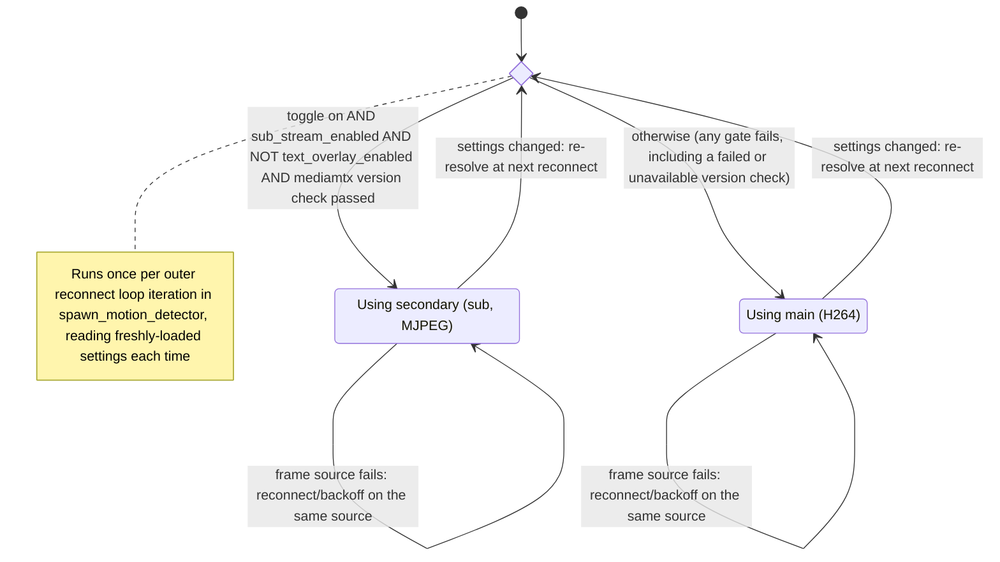

# Design: rpiCameraSecondary as the Motion-Detection Source

<!-- spec-nav:start -->
**Spec navigation:** [State](00_state.md) · [Discovery](01_discovery.md) · [Requirements](02_requirements.md) · [Design](03_design.md) · [Tasks](04_tasks.md) · [Execution](05_execution.md)
<!-- spec-nav:end -->

## Overview

Two independent, small changes land together. First, [`mediamtx_camera_path()`](../../rust/octocam-web/src/mediamtx.rs) stops hardcoding `rpiCameraCodec: hardwareH264` for the secondary path and instead emits the MJPEG-yielding configuration mediamtx itself documents for a secondary stream (R2). Second, [`spawn_motion_detector()`](../../rust/octocam-web/src/motion.rs) gains a small, pure `resolve_motion_source()` step, run once per outer reconnect-loop iteration alongside its existing settings reload, that picks between the existing `main` path and the now-correctly-configured `sub` (secondary) path (R1). A new settings toggle (`motion_use_secondary_stream`, default `false`, R6) and a cached, out-of-band mediamtx version check (R3) gate that choice; both fail closed to `main`, preserving today's behavior exactly whenever they don't hold. Nothing about `main`, HKSV, or the existing `sub` consumers (Matter/HomeKit bridge, web UI live view) changes (R4).

## Current Technology Evidence

Both rows below were checked against mediamtx's current official documentation, consulted via
Context7 (`/bluenviron/mediamtx`), not carried over from training-data memory.

| Technology | Context7 identity/source | Exact selected version | Current-doc question | Decision |
|---|---|---|---|---|
| mediamtx | `/bluenviron/mediamtx` | `>= v1.20.1` (floor; see R3.2) | What configuration does a secondary `rpiCamera` stream require, and how many secondary streams does mediamtx support per camera? | Secondary paths use `rpiCameraCodec: auto` (defaults to MJPEG) plus an explicit `rpiCameraMJPEGQuality`; exactly one secondary stream is supported per `rpiCameraCamID` — confirmed no path exists for a second, independent low-latency stream (see [01_discovery.md](01_discovery.md), rejected Approach B) |
| mediamtx | `/bluenviron/mediamtx` | same | Does mediamtx's local HTTP control API (already used by [`streams.rs`](../../rust/octocam-web/src/streams.rs)) expose a server version field? | No — confirmed the `/v3/paths/list` family of endpoints has no version field; only the `mediamtx --version` CLI flag prints it. R3.2's compatibility check therefore shells out to the binary (see Components below), not the HTTP API |

## Dependency Security Evidence

No new dependency or library applies to this design. The version check reuses the existing
[`proc::run`](../../rust/octocam-web/src/proc.rs) subprocess wrapper (already a project
dependency, already used by [`mediamtx.rs`](../../rust/octocam-web/src/mediamtx.rs) via
`system::restart_service`/`system::set_service_enabled`), and the codec fix only changes string
literals in already-generated YAML — no new third-party crate or npm package is introduced, so
`dependency-security-audit` does not apply.

## Architecture


IR source: [`diagrams/architecture.json`](diagrams/architecture.json) (render-validated).

`Motion_Detector` and `resolve_motion_source()` run inside the same `octocam-web` process and
binary as the settings/API server — there is no IPC here, only a shared on-disk settings file
and a small on-disk version-check cache. This keeps `spawn_motion_detector()`'s existing
architecture (fully decoupled, reload-from-disk, no shared in-memory state with the HTTP
server) intact rather than introducing a new `Arc<Mutex<_>>` channel for one boolean.

The version check deliberately runs **once per settings apply** (`configure_rtsp_service`), not
once per motion reconnect: `mediamtx --version` is cheap, but reconnects can occur many times
during a bad run, and re-invoking a subprocess that many times risks a transient exec failure
flipping the resolved source mid-incident — exactly the "no automatic health-based failover"
non-goal (R1.4) would otherwise be undermined by. Caching the result means a reconnect only
ever changes source when settings actually changed (R1.3), never because of subprocess flakiness.

## Components and Interfaces

### 1. `Settings` — new field ([`settings.rs`](../../rust/octocam-web/src/settings.rs))

- New field `pub motion_use_secondary_stream: bool` on the `Settings` struct, placed next to
  `motion_sensitivity` (currently `settings.rs:91`).
- `Default` impl: `motion_use_secondary_stream: false` (R6.2), alongside the existing
  `motion_enabled: false` entry (currently `settings.rs:264`).
- `validate_map()` (`settings.rs:419`): one additional line,
  `settings.motion_use_secondary_stream = bool_value(&map, "motion_use_secondary_stream", settings.motion_use_secondary_stream);`
  — this is the exact mechanism that already makes every other boolean setting participate
  correctly in the settings-overlay merge (`json_overlay_preserves_untouched_fields_from_current_settings`,
  [`main.rs:2588`](../../rust/octocam-web/src/main.rs)); the new field needs no special-casing.

### 2. `Mediamtx_Config_Generator` — codec fix ([`mediamtx.rs`](../../rust/octocam-web/src/mediamtx.rs))

`mediamtx_camera_path()`'s signature (`mediamtx.rs:258-271`) is unchanged — it already receives
`secondary: bool`. Only its body changes: the codec and (new) MJPEG-quality lines become
conditional on `secondary`, replacing the current unconditional `rpiCameraCodec: hardwareH264`:

```rust
const DEFAULT_SECONDARY_MJPEG_QUALITY: i32 = 60; // mediamtx's own documented example value

let codec = if secondary { "auto" } else { "hardwareH264" };
// ...existing format!() gains one conditional line:
//   rpiCameraCodec: {codec}
//   {mjpeg_quality_line}   (only present when secondary)
```

This satisfies R2.1 (secondary paths get the MJPEG-yielding `auto` codec) and R2.2 (an explicit
`rpiCameraMJPEGQuality`) while R2.3 falls out for free: the primary-path call site
(`mediamtx.rs:150-163`, `secondary: false`) is untouched, so `main` keeps `hardwareH264`
unconditionally.

> [!NOTE]
> `DEFAULT_SECONDARY_MJPEG_QUALITY: 60` is mediamtx's own documented example value, used here as
> a starting point, not a tuned or confirmed one — [01_discovery.md](01_discovery.md)'s Open
> Decision 3 explicitly calls for this to be checked against real captured frames run through
> motion's own downscale pipeline before it's treated as final. That check is task 2.1's
> responsibility (see [04_tasks.md](04_tasks.md)); this design fixes `60` as the value to ship
> with pending that confirmation, not as a settled decision.

The two H264-specific fields `rpiCameraH264Profile`/`rpiCameraIDRPeriod` (`mediamtx.rs:272-285`)
are **not** gated by this change — they stay unconditional regardless of `secondary`, since
mediamtx's own secondary-stream example omits them entirely rather than documenting them as
invalid alongside a non-H264 codec, and no current-doc evidence confirms either behavior.
Task 2.1's on-device test watches for any mediamtx warning/error tied to their presence; if one
appears, gating them behind `!secondary` is a follow-up fix to `mediamtx_camera_path()`, not
something to guess at here.

### 3. mediamtx version check (new) — `mediamtx.rs`

```rust
/// bluenviron/mediamtx#6060 / PR #6061 (commit 8e46f37): the first tagged release
/// confirmed to fix the rpiCameraSecondary startup crash.
pub const MIN_SECONDARY_SAFE_VERSION: (u32, u32, u32) = (1, 20, 1);

pub fn default_version_check_path() -> PathBuf {
    env::var_os("OCTOCAM_MEDIAMTX_VERSION_CHECK_PATH")
        .map(PathBuf::from)
        .unwrap_or_else(|| PathBuf::from("/var/lib/octocam/mediamtx-version-check.json"))
}

pub fn default_binary_path() -> PathBuf {
    env::var_os("OCTOCAM_MEDIAMTX_BINARY_PATH")
        .map(PathBuf::from)
        .unwrap_or_else(|| PathBuf::from("mediamtx")) // resolved via $PATH
}

#[derive(Serialize, Deserialize)]
pub struct VersionCheckResult {
    pub supports_secondary_fix: bool,
    pub checked_version: Option<String>,
    pub checked_at: String, // RFC3339
}

pub fn check_and_write_mediamtx_version(
    binary_path: &Path,
    out_path: &Path,
) -> io::Result<VersionCheckResult>
```

Follows the exact `OCTOCAM_*_PATH` env-override-with-default pattern already used by
[`default_config_path()`](../../rust/octocam-web/src/mediamtx.rs) and the `/var/lib/octocam/`
convention already used for `homekit-status.json`/`octocam.db`
([`main.rs:370-375`](../../rust/octocam-web/src/main.rs)). Internally, it runs
`proc::run(Command::new(binary_path).arg("--version"), <bounded timeout>)`, parses the first
line of stdout for a `v?(\d+)\.(\d+)\.(\d+)` pattern, and compares against
`MIN_SECONDARY_SAFE_VERSION`. Any failure — binary not found, non-zero exit, unparseable
output — resolves `supports_secondary_fix: false` (fail closed) rather than erroring the
settings-save request; it writes its best-effort result and returns it.

Called from `configure_rtsp_service()` (`mediamtx.rs:33`) on every settings save and restore,
alongside the existing `write_mediamtx_config`/`write_timezone_dropin` calls — so the cached
result is refreshed exactly when it could change (a mediamtx binary upgrade requires a service
restart, which only happens through this same path).

> [!NOTE]
> The exact `mediamtx --version` output format is assumed from its CLI flag definition
> (verified via Context7) but not yet observed on real hardware — R3.1's on-device feasibility
> test (still pending; see [01_discovery.md](01_discovery.md), Open Decision 1) is the first
> place this parser sees real output. Task-level verification should confirm the parse against
> the actual string before relying on it, and treat an unexpected format as a parse failure
> (fail closed), not a crash.

### 4. Motion source resolution (new) — `motion.rs`

```rust
#[derive(Debug, Clone, Copy, PartialEq, Eq)]
pub enum MotionSource { Main, Secondary }

fn resolve_motion_source(settings: &Settings, version_check_path: &Path) -> MotionSource {
    let gates_open = settings.motion_use_secondary_stream
        && settings.sub_stream_enabled
        && !settings.text_overlay_enabled;
    if gates_open && mediamtx_supports_secondary_fix(version_check_path) {
        MotionSource::Secondary
    } else {
        MotionSource::Main
    }
}

fn mediamtx_supports_secondary_fix(path: &Path) -> bool {
    // Reads and parses `VersionCheckResult` from `path`; any I/O or parse error,
    // or a missing file, resolves to `false` (fail closed — same policy as the
    // check itself).
}

fn motion_source_path(settings: &Settings, source: MotionSource) -> &str {
    match source {
        MotionSource::Main => &settings.rtsp_path,
        MotionSource::Secondary => &settings.sub_rtsp_path,
    }
}
```

`resolve_motion_source()`'s three-setting shape deliberately mirrors the Matter bridge's
existing `stream_source` selection (`matter.rs:255-256,362`), which already picks `sub` vs.
`main` off `sub_stream_enabled`. It adds one more gate, `!text_overlay_enabled`, that Matter's
selection doesn't need: Matter's snapshot/live-view usage tolerates `sub`'s software-transcoded
variant, but motion's persistent 24/7 reader does not — reusing that variant is exactly what
caused the CPU-starvation regression that moved motion off `sub` in the first place (see
[01_discovery.md](01_discovery.md), Constraints).

The call site at `motion.rs:293-294` (currently `format!("rtsp://127.0.0.1:8554/{}",
settings.rtsp_path...)`) changes to build its URL from `motion_source_path(&settings,
resolve_motion_source(&settings, &version_check_path))` instead of `settings.rtsp_path`
directly. Because the outer reconnect loop already reloads `settings` fresh at the top of every
iteration (`motion.rs:261`), no new polling or shared state is needed for R1.3 — a settings
change already surfaces at the next reconnect for free; this change only widens what that
existing reload feeds into.

R1.4 (no mid-session failover) falls out of the existing control flow: `resolve_motion_source()`
runs once per **outer** loop iteration (i.e., once per reconnect), and a plain frame-read or
connection failure inside an active session is handled entirely by the existing
reconnect/backoff ladder (`motion.rs:46-52,579-582`), which restarts the same outer iteration —
re-running `resolve_motion_source()` against (by construction, in the failure case) unchanged
settings, which deterministically resolves to the same source again.

### 5. Diagnostics — `MotionHealth` / `MotionHealthView` (`motion.rs:65-91`)

`MotionHealth` gains one field, `active_source: AtomicU8` (`0` = not yet resolved this run,
`1` = main, `2` = secondary), set whenever `resolve_motion_source()` runs (alongside the
existing `mark_first_frame()`/session-start bookkeeping). `MotionHealthView` gains
`pub active_source: &'static str` (`"unknown" | "main" | "secondary"`), computed from that
atomic in the existing `snapshot()` method — satisfying R5.1 through the same existing
status/health surface `main.rs:1030` already serializes, with no new API endpoint.

R5.2 (existing blind-time/availability accuracy) requires no code change: `mark_first_frame()`
and `total_blind_ms` operate purely on frame timing, independent of which RTSP path produced
the frame — the property to verify is that this remains true after the source-resolution
change, not that anything about the metric itself needs to change.

## Data Models

Only one new persisted shape, the version-check cache (already fully specified above as
`VersionCheckResult`). `Settings` gains one `bool` field (specified in Component 1). No other
data model changes.

## Sequence / Flows



IR source: [`diagrams/flows.json`](diagrams/flows.json) (render-validated).

## Correctness Properties

### Property 1: Source resolution is total and deterministic
For any `Settings` value and any `VersionCheckResult` (including a missing/unreadable one),
`resolve_motion_source()` returns exactly one of `MotionSource::Main` or
`MotionSource::Secondary` — never panics, never leaves the source unresolved.
**Validates: Requirements 1.1, 1.2, 1.5**

### Property 2: Reconnect re-resolves; mid-session failure does not
A settings change affecting the three gates is reflected starting from the next outer-loop
iteration (reconnect), never mid-session; a frame-read or connection failure within an active
session retries the same resolved source and never triggers a fresh call to
`resolve_motion_source()` mid-backoff.
**Validates: Requirements 1.3, 1.4**

### Property 3: Primary-path codec is never touched by the secondary-path fix
For any settings that produce a non-secondary (`secondary: false`) call to
`mediamtx_camera_path()`, its output is byte-for-byte identical before and after this change
(still `rpiCameraCodec: hardwareH264`, no MJPEG-quality line).
**Validates: Requirements 2.3**

### Property 4: Secondary-path codec always requests MJPEG
For any settings that produce a secondary (`secondary: true`) call to `mediamtx_camera_path()`,
the output contains `rpiCameraCodec: auto` and a `rpiCameraMJPEGQuality` line.
**Validates: Requirements 2.1, 2.2**

### Property 5: The version-gate fails closed
If `check_and_write_mediamtx_version()` cannot determine a version that meets
`MIN_SECONDARY_SAFE_VERSION` — binary missing, non-zero exit, unparseable output, or the cache
file being absent/corrupt when `mediamtx_supports_secondary_fix()` reads it — the resolved
source is `Main`, regardless of the user's settings.
**Validates: Requirements 3.2**

### Property 9: The generated secondary configuration matches mediamtx's documented stable shape
The rendered secondary path never combines `rpiCameraSecondary: true` with `rpiCameraCodec:
hardwareH264` — the exact combination this feature's own configuration generator used to
produce, and the shape implicated in the crash that stayed unfixed until mediamtx v1.20.1. This
is necessary, but not by itself sufficient, evidence for R3.1: it rules out the config-level
cause of the original regression, but final confirmation of crash-free startup on real hardware
still requires the pending on-device feasibility test (see Testing Strategy below).
**Validates: Requirements 3.1**

### Property 6: Reader capacity for the secondary path is already sufficient
`reserve` already adds `i32::from(settings.motion_enabled)` to `maxReaders` on both `main` and
`sub` (`mediamtx.rs:142-149`) independent of which path motion actually reads — motion becoming
a `sub` reader introduces no new reader-capacity contention for the Matter bridge or the web
UI's live view.
**Validates: Requirements 4.1, 4.2**

### Property 7: Health output always names the active source, and blind-time accuracy is source-independent
Once a session's source is resolved, `MotionHealthView.active_source` reflects it; the
blind-time/availability calculation in `mark_first_frame()`/`total_blind_ms` depends only on
frame arrival timing, never on which RTSP path produced the frame.
**Validates: Requirements 5.1, 5.2**

### Property 8: The toggle is exposed and defaults safe
`Settings_UI` renders a control bound to `motion_use_secondary_stream`; a fresh `Settings`
value (new install) and an existing installation's settings file lacking this key (upgrade)
both resolve to `false`.
**Validates: Requirements 6.1, 6.2**

## Error Handling / Edge Cases

- **R1.2 / R1.4 (unwanted conditions):** covered by Properties 1 and 2 above — every disabled
  gate, and every mid-session failure, falls back to (or stays on) `Main`.
- **R3.2 (unwanted condition):** covered by Property 5 — every version-check failure mode
  (missing binary, bad exit, unparseable output, missing/corrupt cache file) fails closed.
- **Settings file predates this field (upgrade case):** `bool_value()`'s existing
  current-value-as-default behavior (`settings.rs:528`-style helper) means a missing JSON key
  resolves to the `Default` impl's `false`, satisfying R6.2's "existing installations" clause
  with no migration code.

## Testing Strategy

- **Unit tests, `mediamtx.rs`:** assert `mediamtx_camera_path(secondary: true, ...)` contains
  `rpiCameraCodec: auto` and `rpiCameraMJPEGQuality`; assert `mediamtx_camera_path(secondary:
  false, ...)` is unchanged from its current golden output (Properties 3, 4).
- **Unit tests, `motion.rs`:** table-test `resolve_motion_source()` across all 2^3 combinations
  of the three settings gates crossed with both version-check outcomes (supported/unsupported/
  missing-file) — 24 cases total — asserting `Secondary` only when all four conditions hold
  (Property 1); a focused test that an unchanged `VersionCheckResult`/settings pair resolves
  identically on repeated calls (Property 2, the "no mid-session flip" guarantee, expressed as
  determinism rather than by driving the real reconnect loop).
- **Unit tests, version check:** feed `check_and_write_mediamtx_version()` canned subprocess
  outputs (via a wrapper the test can substitute — the exact seam is a task-level decision) for
  a supported version string, an old version string, a malformed string, and a non-zero exit;
  assert `supports_secondary_fix` matches expectation in every case, always failing closed
  (Property 5).
- **Regression tests:** existing `matter.rs:593-634` stream-source tests and existing
  `MotionHealthView` serialization tests continue to pass unmodified, confirming Properties 6
  and 7 don't require changing either.
- **On-device verification (blocking, not a unit test):** R3.1 — the ≥10 consecutive crash-free
  `octocam-rtsp` restarts with the secondary path configured — remains unverified until the
  feasibility test in [01_discovery.md](01_discovery.md) runs on the actual Pi. This design does
  not claim R3.1 is satisfied; it only ensures that if the on-device test fails, R3.2's fallback
  (Property 5) keeps the feature inert (default-off, and fail-closed even if force-enabled)
  rather than shipping a config that could reintroduce the crash.

## Cross-Cutting Risk Gates

- **Security/authorization:** not applicable — no new external input surface; the version
  check invokes a fixed, non-user-controlled binary path/argument (`--version`), and the
  settings toggle is gated by the same admin-session authorization every other setting already
  requires.
- **Privacy:** not applicable — no new data leaves the device; the version-check file contains
  only a version string and a timestamp.
- **Accessibility:** the new toggle reuses the existing `Switch`/`<label>` pattern already used
  throughout the settings UI (e.g. `MotionSection.tsx:51-58`), inheriting its existing
  accessibility semantics.
- **Performance:** the version check is one bounded subprocess call per settings save/restore
  (not per reconnect, not per frame) — see Architecture's rationale above. The MJPEG secondary
  stream's actual CPU/latency impact is exactly what's unverified pending R3.1's on-device test;
  this design does not assert a performance improvement, only that the mechanism to measure and
  gate it is in place.
- **Observability:** covered by R5/Property 7 — the active source is visible in existing health
  output; the version-check result is persisted to a readable JSON file for operator inspection.
- **Migration:** covered under Error Handling — a settings file predating this field resolves
  the new field to `false` via the existing default-current-value overlay mechanism, no
  migration code required.
- **Rollout:** the toggle defaults to `false` for both new and existing installations (R6.2);
  the feature has zero effect on any deployment until an operator explicitly opts in.
- **Rollback:** flipping `motion_use_secondary_stream` back to `false` (Settings_UI) restores
  today's `main`-only behavior exactly, with no code change or redeploy required — the
  reversibility basis for choosing Approach A in discovery.

## Approval

Status: **Approved on 2026-09-05**.
