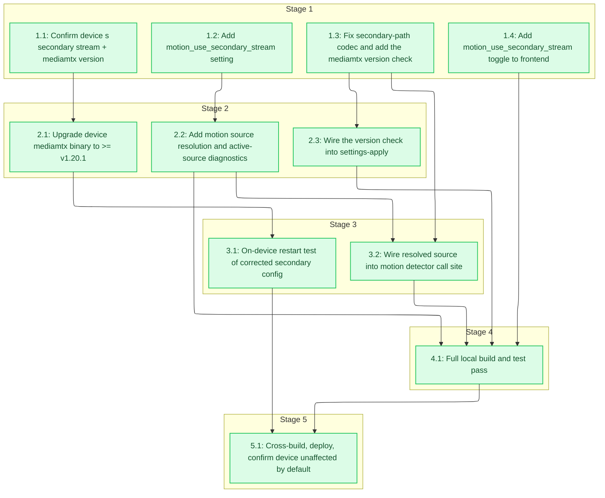

# Tasks: rpiCameraSecondary as the Motion-Detection Source

<!-- spec-nav:start -->
**Spec navigation:** [State](00_state.md) · [Discovery](01_discovery.md) · [Requirements](02_requirements.md) · [Design](03_design.md) · [Tasks](04_tasks.md) · [Execution](05_execution.md)
<!-- spec-nav:end -->

## Stage and Dependency Overview

> [!WARNING]
> Execute dependency stages in order. Run tasks concurrently only when each is marked
> `parallel-safe`, their ownership is disjoint, and isolated worktrees are available. Stop at
> every checkpoint for human review.

- [x] 1. Foundations and pre-flight check
  - [x] 1.1 Confirm device's secondary stream + mediamtx version
    - SSH to the device (`root@octocam.local`, or `octocam.tailcb3419.ts.net` via Tailscale) and, read-only:
      - Read the currently-effective `sub_stream_enabled`/`text_overlay_enabled` values (from the running settings, not this worktree).
      - Read the currently-rendered `/etc/mediamtx.yml` to see whether the `sub` path is already reaching `rpiCameraSecondary: true` today (i.e. whether the pending codec fix in task 1.3 would change a path that's *already live*, independent of the new toggle).
      - Run `mediamtx --version` (or read the installed binary's version another way) to know the starting point for the `>= v1.20.1` floor.
    - Record the three findings in the execution report; do not change anything on the device in this task.
    - **Files:** none (read-only SSH session; findings recorded in [`execution/`](execution))
    - **Dependency resolution:** none
    - **Dependency delivery:** none
    - **Stage:** 1
    - **Interfaces:** Consumes: SSH access to the device; Produces: a recorded snapshot of `sub_stream_enabled`, `text_overlay_enabled`, current `/etc/mediamtx.yml` secondary-path codec, and installed mediamtx version, used to scope tasks 2.1 and 3.1's blast radius
    - **Documentation:** no public surface
    - **Verification:** the three findings above are captured in the task's execution report
    - **Estimated effort:** 10-20 minutes
    - **Risk:** low; read-only, no device state changes
    - **Task category:** review
    - **Delegation:** controller
    - _Requirements: 3.1_
  - [x] 1.2 Add `motion_use_secondary_stream` setting
    - Add `pub motion_use_secondary_stream: bool` to the `Settings` struct in [`settings.rs`](../../rust/octocam-web/src/settings.rs), next to `motion_sensitivity` (currently `settings.rs:91`).
    - Add `motion_use_secondary_stream: false` to the `Default` impl, alongside `motion_enabled: false` (currently `settings.rs:264`).
    - Add one line to `validate_map()` (`settings.rs:419`): `settings.motion_use_secondary_stream = bool_value(&map, "motion_use_secondary_stream", settings.motion_use_secondary_stream);`, matching the existing `motion_enabled` line exactly in form.
    - Classify the new field in [`backup.rs`](../../rust/octocam-web/src/backup.rs)'s `PORTABLE_FIELDS` allow-list (a user preference like `motion_enabled`/`sub_stream_enabled`, so it belongs in a device backup) — discovered mid-execution via `backup::tests::field_lists_cover_all_settings`, which fails closed on any unclassified `Settings` field; this file wasn't in the original task scope.
    - **Files:** [`rust/octocam-web/src/settings.rs`](../../rust/octocam-web/src/settings.rs), [`rust/octocam-web/src/backup.rs`](../../rust/octocam-web/src/backup.rs)
    - **Dependency resolution:** none
    - **Dependency delivery:** none
    - **Stage:** 1
    - **Interfaces:** Consumes: none (new field, no prior task output); Produces: `Settings.motion_use_secondary_stream: bool` (default `false`), a JSON-serializable key named `motion_use_secondary_stream`, and a `validate_map()` entry that participates in the existing settings-overlay merge
    - **Documentation:** no public surface (matches the existing bare-field style of this struct — no other field carries a doc comment)
    - **Verification:** `cargo test -p octocam-web settings::` passes, including `json_overlay_preserves_untouched_fields_from_current_settings` (unmodified, confirming the new field participates correctly); a new test asserts a settings JSON payload missing this key defaults to `false`
    - **Estimated effort:** 20-30 minutes
    - **Risk:** low
    - **Task category:** code_analysis
    - **Delegation:** parallel-safe
    - _Requirements: 6.2_
  - [x] 1.3 Fix secondary-path codec and add the mediamtx version check
    - In [`mediamtx.rs`](../../rust/octocam-web/src/mediamtx.rs), change `mediamtx_camera_path()` (`mediamtx.rs:258-290`) so the codec line is conditional on `secondary`: `rpiCameraCodec: auto` plus a new `rpiCameraMJPEGQuality: 60` line when `secondary` is `true`; `rpiCameraCodec: hardwareH264` (today's unconditional value) when `secondary` is `false`. Add `const DEFAULT_SECONDARY_MJPEG_QUALITY: i32 = 60;`.
    - Add the version-check module to the same file: `pub const MIN_SECONDARY_SAFE_VERSION: (u32, u32, u32) = (1, 20, 1);`, `pub fn default_version_check_path() -> PathBuf` (env override `OCTOCAM_MEDIAMTX_VERSION_CHECK_PATH`, default `/var/lib/octocam/mediamtx-version-check.json`, mirroring `default_config_path()`), `pub fn default_binary_path() -> PathBuf` (env override `OCTOCAM_MEDIAMTX_BINARY_PATH`, default `"mediamtx"`), `pub struct VersionCheckResult { pub supports_secondary_fix: bool, pub checked_version: Option<String>, pub checked_at: String }` (`Serialize, Deserialize`), and `pub fn check_and_write_mediamtx_version(binary_path: &Path, out_path: &Path) -> io::Result<VersionCheckResult>` using [`proc::run`](../../rust/octocam-web/src/proc.rs) with a bounded timeout, parsing the first line of `--version` output for `v?(\d+)\.(\d+)\.(\d+)`, failing closed (`supports_secondary_fix: false`) on any missing binary, non-zero exit, or unparseable output.
    - Do **not** wire `check_and_write_mediamtx_version()` into `configure_rtsp_service()` yet — that's task 2.3, once this module exists and compiles standalone.
    - **Files:** [`rust/octocam-web/src/mediamtx.rs`](../../rust/octocam-web/src/mediamtx.rs)
    - **Dependency resolution:** none
    - **Dependency delivery:** none
    - **Stage:** 1
    - **Interfaces:** Consumes: none; Produces: corrected `mediamtx_camera_path()` output (primary-path output byte-for-byte unchanged; secondary-path output now MJPEG-coded), plus the new public `MIN_SECONDARY_SAFE_VERSION`/`default_version_check_path`/`default_binary_path`/`VersionCheckResult`/`check_and_write_mediamtx_version` symbols for tasks 2.2/2.3 to consume
    - **Documentation:** required — doc comments on `MIN_SECONDARY_SAFE_VERSION` (cite `bluenviron/mediamtx#6060`/PR #6061/commit `8e46f37`), on `check_and_write_mediamtx_version` (state its fail-closed contract explicitly), and on `VersionCheckResult`'s fields
    - **Verification:** unit tests assert `mediamtx_camera_path(secondary: true, ...)` contains `rpiCameraCodec: auto` and `rpiCameraMJPEGQuality: 60`; a golden-output test asserts `mediamtx_camera_path(secondary: false, ...)` is byte-for-byte identical to its pre-change output (Property 3); unit tests for `check_and_write_mediamtx_version` cover a supported version string, an old version string, a malformed string, and a non-zero/missing-binary exit, asserting `supports_secondary_fix` matches expectation and always fails closed on error (Property 5); a documentation review confirms the required comments above are present
    - **Estimated effort:** 1-2 hours
    - **Risk:** medium; touches config generation for an existing, already-live path (`sub`) — mitigated by the golden-output test locking the primary path unchanged and by task 3.1's on-device confirmation that the corrected secondary output doesn't crash
    - **Task category:** code_analysis
    - **Delegation:** parallel-safe
    - _Requirements: 2.1, 2.2, 2.3, 3.2_
  - [x] 1.4 Add motion_use_secondary_stream toggle to frontend
    - Add a `Switch`/`<label>` control to [`MotionSection.tsx`](../../frontend/src/components/stream/MotionSection.tsx), following the exact pattern of the existing `motion_enabled` toggle (`MotionSection.tsx:51-58`), bound to `motionUseSecondaryStream`.
    - Add `motion_use_secondary_stream: boolean` to the settings type in [`api.ts`](../../frontend/src/lib/api.ts) next to `motion_enabled` (`api.ts:204`), and the corresponding `motionUseSecondaryStream` field to `MotionFormState`/`MotionFormPatch` in [`frontend/src/components/stream/types.ts`](../../frontend/src/components/stream/types.ts).
    - **Files:** [`frontend/src/components/stream/MotionSection.tsx`](../../frontend/src/components/stream/MotionSection.tsx), [`frontend/src/lib/api.ts`](../../frontend/src/lib/api.ts), [`frontend/src/components/stream/types.ts`](../../frontend/src/components/stream/types.ts)
    - **Dependency resolution:** none
    - **Dependency delivery:** none
    - **Stage:** 1
    - **Interfaces:** Consumes: the JSON field name `motion_use_secondary_stream` fixed by task 1.2's design (not its compiled output — frontend and backend build independently); Produces: a settings-page control that reads/writes `motion_use_secondary_stream` through the existing partial-update mutation
    - **Documentation:** no public surface (matches existing component style — no doc comments on sibling toggle components)
    - **Verification:** `npm run build` succeeds; manual check in the dev server that toggling the control round-trips through a settings save
    - **Estimated effort:** 30-45 minutes
    - **Risk:** low
    - **Task category:** code_analysis
    - **Delegation:** parallel-safe
    - _Requirements: 6.1_

- [x] 2. Feasibility test and motion source resolution
  - [x] 2.1 Upgrade device mediamtx binary to >= v1.20.1
    - Task 1.1 found the device's installed `mediamtx` is `v1.19.2` — below `MIN_SECONDARY_SAFE_VERSION` and in the exact range affected by the original crash (bluenviron/mediamtx#6060). Task 3.1's restart test cannot safely proceed against this binary: testing the corrected secondary config on an unfixed mediamtx would very likely reproduce the crash on the live device.
    - Back up the current binary (`cp /usr/local/bin/mediamtx /usr/local/bin/mediamtx.v1.19.2.bak`).
    - Download the official `v1.20.1` `linux_arm64` release tarball directly on the device (confirmed reachable in task 1.1: `HTTP 200` from `github.com/bluenviron/mediamtx/releases/download/v1.20.1/mediamtx_v1.20.1_linux_arm64.tar.gz`), extract it, and verify the extracted binary reports `v1.20.1` via `--version` *before* touching the installed one.
    - Stop `octocam-rtsp`, swap the binary at `/usr/local/bin/mediamtx`, restart, and confirm: the service comes up healthy against the **unmodified, existing** `/etc/mediamtx.yml` (no secondary-stream config yet — this step upgrades the binary only), `main` streams normally, and `mediamtx --version` now reports `v1.20.1`.
    - **If anything looks wrong after the swap:** stop `octocam-rtsp`, restore `mediamtx.v1.19.2.bak` over the binary, restart, and confirm the device is back to its exact pre-upgrade state before proceeding.
    - **Files:** none in this repo (device binary upgrade only)
    - **Dependency resolution:** none
    - **Dependency delivery:** none
    - **Depends on:** 1.1
    - **Stage:** 2
    - **Interfaces:** Consumes: task 1.1's finding (installed version `v1.19.2`, confirmed GitHub-release reachability); Produces: the device's `mediamtx` binary at `>= v1.20.1`, the actual precondition task 3.1's restart test needs
    - **Documentation:** no public surface
    - **Verification:** `mediamtx --version` reports `v1.20.1`; `octocam-rtsp` is `active`; `main` stream still works against the unmodified existing config
    - **Estimated effort:** 20-30 minutes
    - **Risk:** medium; replaces the binary the live camera's only streaming service runs on — mitigated by a full binary backup and an immediate binary-only rollback path (no config change in this step, so a failure here is isolated to "which mediamtx binary runs," not "what it's configured to do")
    - **Task category:** review
    - **Delegation:** controller
    - _Requirements: 3.1_
  - [x] 2.2 Add motion source resolution and active-source diagnostics
    - In [`motion.rs`](../../rust/octocam-web/src/motion.rs), add `pub enum MotionSource { Main, Secondary }`, `fn resolve_motion_source(settings: &Settings, version_check_path: &Path) -> MotionSource` (the three-gate check — `motion_use_secondary_stream && sub_stream_enabled && !text_overlay_enabled` — AND-ed with `mediamtx_supports_secondary_fix(version_check_path)`), `fn mediamtx_supports_secondary_fix(path: &Path) -> bool` (reads/parses `VersionCheckResult` from `path`; any I/O or parse error, or missing file, resolves `false`), and `fn motion_source_path(settings: &Settings, source: MotionSource) -> &str` (returns `&settings.rtsp_path` or `&settings.sub_rtsp_path`).
    - Add `active_source: AtomicU8` to `MotionHealth` (`motion.rs:65-76`, `0` = unresolved, `1` = main, `2` = secondary) and `pub active_source: &'static str` to `MotionHealthView` (`motion.rs:80-91`, `"unknown" | "main" | "secondary"`), computed from the atomic in the existing `snapshot()` method. Add a `MotionHealth` method to set it (called from task 3.2's call-site wiring, not here).
    - **Files:** [`rust/octocam-web/src/motion.rs`](../../rust/octocam-web/src/motion.rs)
    - **Dependency resolution:** none
    - **Dependency delivery:** none
    - **Depends on:** 1.2
    - **Stage:** 2
    - **Interfaces:** Consumes: `Settings.motion_use_secondary_stream` (task 1.2), `VersionCheckResult`'s on-disk JSON shape (task 1.3, consumed structurally via the same field names, not a compiled dependency since this function takes a bare `&Path`); Produces: `MotionSource`, `resolve_motion_source()`, `motion_source_path()`, and `MotionHealthView.active_source`, for task 3.2 to wire into the reconnect loop
    - **Documentation:** required — doc comments on `MotionSource`, `resolve_motion_source` (state the fail-closed/no-mid-session-switch contract), and `mediamtx_supports_secondary_fix` (state the fail-closed contract on read/parse error)
    - **Verification:** a 24-case table test (2^3 settings-gate combinations x 3 version-check outcomes: supported / unsupported / missing-file) asserts `Secondary` only when all four conditions hold (Property 1); a determinism test asserts repeated calls with unchanged inputs return the same source (Property 2's "no spurious flip" half); existing `MotionHealthView` serialization tests still pass unmodified aside from the new field; a documentation review confirms the required comments above
    - **Estimated effort:** 1.5-2.5 hours
    - **Risk:** low; new, additive functions with no existing call site touched yet
    - **Task category:** code_analysis
    - **Delegation:** parallel-safe
    - _Requirements: 1.1, 1.2, 1.5, 3.2, 5.1, 5.2_
  - [x] 2.3 Wire the version check into settings-apply
    - Call `check_and_write_mediamtx_version(&default_binary_path(), &default_version_check_path())` from `configure_rtsp_service()` ([`mediamtx.rs:33`](../../rust/octocam-web/src/mediamtx.rs)), alongside the existing `write_mediamtx_config`/`write_timezone_dropin` calls, so the cached result refreshes on every settings save and restore.
    - **Files:** [`rust/octocam-web/src/mediamtx.rs`](../../rust/octocam-web/src/mediamtx.rs)
    - **Dependency resolution:** none
    - **Dependency delivery:** none
    - **Depends on:** 1.3
    - **Stage:** 2
    - **Interfaces:** Consumes: `check_and_write_mediamtx_version`/`default_binary_path`/`default_version_check_path` (task 1.3); Produces: an up-to-date `VersionCheckResult` cache file refreshed on every `configure_rtsp_service()` call, which task 2.2's `mediamtx_supports_secondary_fix()` reads
    - **Documentation:** no public surface (call-site wiring only, inside an already-documented function)
    - **Verification:** a test on `configure_rtsp_service()` (or an integration test around it) confirms the version-check file is written/refreshed on each call; existing `configure_rtsp_service`/`write_mediamtx_config` tests still pass unmodified
    - **Estimated effort:** 20-30 minutes
    - **Risk:** low
    - **Task category:** code_analysis
    - **Delegation:** parallel-safe
    - _Requirements: 3.2_

- [x] 3. On-device feasibility test and motion-detector wiring
  - [x] 3.1 On-device restart test of corrected secondary config
    - Back up the device's current `/etc/mediamtx.yml`.
    - Hand-edit a temporary copy that matches the exact corrected secondary-path shape from [03_design.md](03_design.md) Component 2 (`rpiCameraSecondary: true`, `rpiCameraCodec: auto`, `rpiCameraMJPEGQuality: 60`) on whatever path is already the secondary slot (per task 1.1's finding).
    - Install the temporary config and restart `octocam-rtsp` **10 consecutive times**, confirming zero startup crashes each time (the original bug crashed 3/3 times — this is the regression bar, R3.1). This is only safe now that task 2.1 has upgraded the device's mediamtx to `>= v1.20.1`.
    - While the temporary config is live, start a synthetic persistent reader against the secondary path (e.g. `ffmpeg -rtsp_transport tcp -i rtsp://127.0.0.1:8554/<secondary-path> -f null -` left running for the duration of the test) to stand in for motion detection's real 24/7 access pattern — this feature's code changes don't land until task 3.2, so this is the only way to actually exercise R4.1/R4.2 (no regression for existing secondary-stream consumers under a concurrent persistent reader) before task 5.1's deploy. With that synthetic reader running, confirm the Matter/HomeKit bridge's live view + snapshot and the web UI's live view still work against the now-MJPEG secondary stream.
    - Capture a few seconds of raw frames from the secondary path at `rpiCameraMJPEGQuality: 60` and run them through the same `-vf fps=5,scale=80:60,format=gray` downscale motion.rs uses, to sanity-check that quality 60 doesn't introduce compression artifacts that would degrade motion detection at that resolution — discovery flagged this exact constant as needing real-frame confirmation, not a value to treat as settled from design alone.
    - Watch the mediamtx logs/output during all of the above for any warning or error related to `rpiCameraH264Profile`/`rpiCameraIDRPeriod` being present alongside the non-H264 `rpiCameraCodec: auto` secondary path (these two fields stay unconditional in task 1.3's fix — confirmed, unlike the codec/quality lines). If anything appears, note it as a required follow-up fix to gate those two fields behind `!secondary` in `mediamtx_camera_path()` before this feature can be considered done.
    - Restore the original `/etc/mediamtx.yml` backup, stop the synthetic reader, and restart `octocam-rtsp` once more, confirming the device is back to its exact starting state.
    - Record: crash count (expect 0/10), qualitative Matter/web-UI live-view behavior under the synthetic persistent reader, the MJPEG-quality frame-sanity check result, any H264-field warning observed, and — opportunistically, not as a hard requirement — the observed time-to-first-frame on the corrected secondary path vs. today's `main` baseline, since discovery flagged the previously-quoted 78%/2.6s figures as unverifiable.
    - **If any crash occurs:** stop, restore the backup immediately, and treat this task as failed — task 5.1 (deploy) must not proceed until this is re-run and passes.
    - **Files:** none in this repo (temporary, restored device-side config only)
    - **Dependency resolution:** none
    - **Dependency delivery:** none
    - **Depends on:** 2.1
    - **Stage:** 3
    - **Interfaces:** Consumes: task 1.1's snapshot (which path is secondary) and task 2.1's upgraded mediamtx (`>= v1.20.1`); Produces: a pass/fail verdict for R3.1 (10/10 crash-free) and R4.1/R4.2 (no regression for existing secondary-stream consumers), gating the final deploy task
    - **Documentation:** no public surface
    - **Verification:** 10/10 restarts crash-free; Matter and web UI live view both confirmed working while the synthetic persistent reader is attached; MJPEG-quality frame sanity check shows no detection-relevant artifacts at quality 60; no H264-field warnings observed (or a follow-up fix noted if there are); device restored to its original config afterward
    - **Estimated effort:** 45-75 minutes
    - **Risk:** medium; temporarily alters the live camera's secondary stream and restarts a service the operator depends on — mitigated by a backup/restore of the exact original file and a fail-fast abort-and-restore on the first crash
    - **Task category:** review
    - **Delegation:** controller
    - _Requirements: 3.1, 4.1, 4.2_
  - [x] 3.2 Wire resolved source into motion detector call site
    - In `spawn_motion_detector()`'s outer reconnect loop, at the URL-building call site currently reading `settings.rtsp_path` directly ([`motion.rs:293-294`](../../rust/octocam-web/src/motion.rs)), compute `let source = resolve_motion_source(&settings, &mediamtx::default_version_check_path()); let path = motion_source_path(&settings, source);` and build the RTSP URL from `path` instead. Call `MotionHealth`'s new setter to record `active_source` from `source` at the same point.
    - Rewrite the now-stale rationale comment at `motion.rs:276-292` (currently explaining why motion always reads `main` and never `sub`) to describe the new conditional behavior instead — point to `resolve_motion_source`'s own doc comment for the fail-closed/gating rationale rather than duplicating it, so the comment doesn't read as contradicting the code once this task lands.
    - **Files:** [`rust/octocam-web/src/motion.rs`](../../rust/octocam-web/src/motion.rs)
    - **Dependency resolution:** none
    - **Dependency delivery:** none
    - **Depends on:** 1.3, 2.2
    - **Stage:** 3
    - **Interfaces:** Consumes: `resolve_motion_source`/`motion_source_path` (task 2.2), `mediamtx::default_version_check_path` (task 1.3); Produces: the outer reconnect loop's frame-source URL is now settings-and-version-gated instead of hardcoded to `settings.rtsp_path`, and `MotionHealthView.active_source` reflects the live session's source
    - **Documentation:** no public surface beyond correcting the existing stale comment at `motion.rs:276-292` (internal call-site change inside an already-documented function)
    - **Verification:** an integration-style test (or a refactor of the existing motion-loop tests, if any exist at this call site) confirms the built URL matches `main`'s path when the gates are closed and `sub`'s path when all four conditions hold; manual trace confirms a mid-session ffmpeg failure re-enters the same outer iteration without a source change when settings are unchanged (Property 2); the old rationale comment no longer contradicts the new conditional behavior
    - **Estimated effort:** 45-60 minutes
    - **Risk:** medium; this is the one call site that changes motion's real runtime behavior — mitigated by task 3.1's on-device confirmation and by R6.2's default-off toggle meaning this code path is inert until an operator opts in
    - **Task category:** code_analysis
    - **Delegation:** sequential subagent
    - _Requirements: 1.3, 1.4, 5.1_

- [x] 4. Local verification
  - [x] 4.1 Full local build and test pass
    - Run `npm run build` in [`frontend/`](../../frontend) (required before the Rust build, since `rust-embed` needs [`frontend/dist`](../../frontend/dist) to exist), then `cargo build` and `cargo test` for `octocam-web`, confirming all existing tests plus every new test from tasks 1.2-3.2 pass.
    - **Files:** none (verification only)
    - **Dependency resolution:** none
    - **Dependency delivery:** none
    - **Depends on:** 1.4, 2.2, 2.3, 3.2
    - **Stage:** 4
    - **Interfaces:** Consumes: all code changes from tasks 1.2-3.2; Produces: a passing local build/test run, the precondition for the final deploy task
    - **Documentation:** no public surface
    - **Verification:** `npm run build && cargo build && cargo test` exits 0 with zero failing tests
    - **Estimated effort:** 15-20 minutes
    - **Risk:** low
    - **Task category:** code_analysis
    - **Delegation:** controller
    - _Requirements: 1.1, 1.2, 1.5, 2.1, 2.2, 2.3, 3.2, 5.1, 5.2, 6.1, 6.2_

- [x] 5. Checkpoint — deploy and confirm
  - [x] 5.1 Cross-build, deploy, confirm device unaffected by default
    - Cross-build the release binary on the Mac (never build on the Pi, per project convention), rsync it to the device alongside the frontend build, restart `octocam-web`, and confirm: the device comes up cleanly; `motion_use_secondary_stream` reads back as `false` (R6.2's default, both for a fresh install and for this existing device's upgraded settings file); motion detection continues reading `main` exactly as before (no behavior change until an operator opts in); the version-check cache file now exists at `/var/lib/octocam/mediamtx-version-check.json` (task 2.3's effect).
    - **Files:** none in this repo (deployment action)
    - **Dependency resolution:** none
    - **Dependency delivery:** none
    - **Depends on:** 3.1, 4.1
    - **Stage:** 5
    - **Interfaces:** Consumes: task 4.1's verified build, task 3.1's on-device pass/fail verdict (must be a pass to proceed); Produces: the feature live on the device, inert by default (R6.2), ready for the operator to opt in via the new Settings_UI toggle
    - **Documentation:** no public surface
    - **Verification:** device health/status endpoint shows `motion_use_secondary_stream: false` and `active_source: "main"` post-deploy; no crash or restart loop observed
    - **Estimated effort:** 20-30 minutes
    - **Risk:** high; a production deploy to the operator's only camera — rollback is a redeploy of the previous binary (no data migration, no schema change) or, if needed, disabling the systemd unit temporarily; gated on task 3.1's crash-free verdict specifically to avoid deploying an unverified config-generation change
    - **Task category:** review
    - **Delegation:** controller
    - _Requirements: 6.2_

## Delivery Schedule

| Stage | Task | Estimate | Depends on | Critical path |
|---:|---|---|---|---|
| 1 | 1.1 | 10-20 min | none | yes |
| 1 | 1.2 | 20-30 min | none | yes |
| 1 | 1.3 | 1-2 hr | none | yes |
| 1 | 1.4 | 30-45 min | none | no |
| 2 | 2.1 | 20-30 min | 1.1 | yes |
| 2 | 2.2 | 1.5-2.5 hr | 1.2 | yes |
| 2 | 2.3 | 20-30 min | 1.3 | no |
| 3 | 3.1 | 45-75 min | 2.1 | yes |
| 3 | 3.2 | 45-60 min | 1.3, 2.2 | yes |
| 4 | 4.1 | 15-20 min | 1.4, 2.2, 2.3, 3.2 | yes |
| 5 | 5.1 | 20-30 min | 3.1, 4.1 | yes |

No calendar dates are confirmed for this feature; estimates are bounded durations for
scheduling, not commitments.
