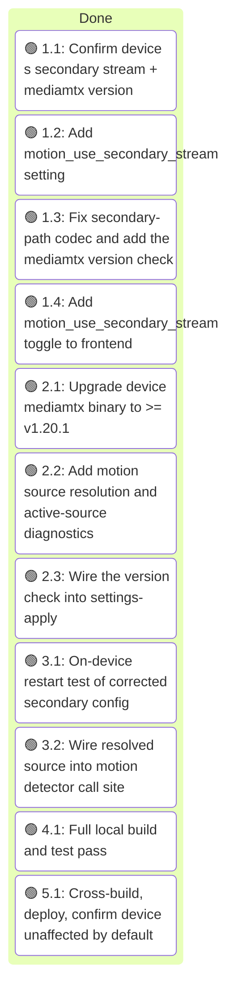
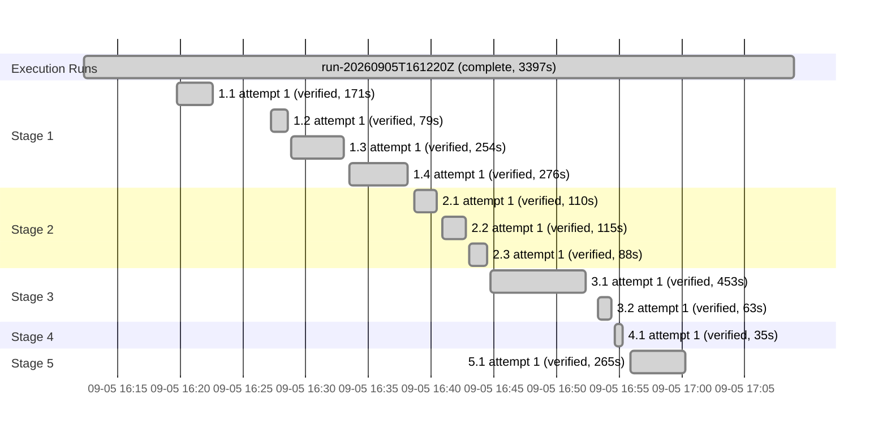

# Execution Ledger: rpiCameraSecondary as the Motion-Detection Source

<!-- spec-nav:start -->
**Spec navigation:** [State](00_state.md) · [Discovery](01_discovery.md) · [Requirements](02_requirements.md) · [Design](03_design.md) · [Tasks](04_tasks.md) · [Execution](05_execution.md)
<!-- spec-nav:end -->

## Preflight

- **Isolation:** git worktree at [`.worktrees/rpicamerasecondary-motion`](../..), branch
  `feat/rpicamerasecondary-motion`, base commit `7ee3912` (main at the time the worktree was
  created). The main checkout has unrelated in-progress, uncommitted work (a
  `lan-unauthenticated-dashboard` feature) that this run does not touch.
- **Baseline:** `npm run build && cargo build && cargo test` — 153/153 Rust tests passing, 0
  pre-existing failures, frontend builds cleanly (confirmed before spec work began).
- **Self-hardening preflight:** depth `quick` (1 reviewer, `economical` tier, `low` reasoning,
  resolved via `fanout.py --depth quick`) — the feature is small (one crate, one frontend
  section, no migration/auth/payment surface) and already extensively grounded against source
  and Context7-verified mediamtx docs during discovery/design. One reviewer read all four
  numbered artifacts against the real source files. Findings and resolutions:

  | # | Finding | Certainty | Resolution |
  |---|---|---|---|
  | 1 | Task 2.1 never actually exercised R4.1/R4.2 under a persistent reader simulating motion's real access pattern, since motion's code doesn't exist until Stage 3 | CERTAIN | Added a synthetic persistent `ffmpeg` reader to task 2.1's procedure |
  | 2 | Task 2.2's `_Requirements:_` line omitted R3.2 despite implementing its fail-closed gate | CERTAIN | Added `3.2` to task 2.2 |
  | 3 | Task 3.1's `_Requirements:_` line omitted R5.1 despite being the task that sets `active_source` | CERTAIN | Added `5.1` to task 3.1 |
  | 4 | `DEFAULT_SECONDARY_MJPEG_QUALITY: 60` was presented as settled in design/tasks, contradicting discovery's Open Decision 3 (needs real-frame confirmation) | CERTAIN | Added a frame-quality sanity check to task 2.1; added a provisional-value note to [03_design.md](03_design.md) |
  | 5 | Task 3.1 didn't address the now-stale rationale comment at `motion.rs:276-292` that will contradict the new conditional behavior | CERTAIN | Added an explicit rewrite step to task 3.1 |
  | 6 | `rpiCameraH264Profile`/`rpiCameraIDRPeriod` stay unconditional even for the MJPEG secondary path — unclear if mediamtx tolerates this | UNCERTAIN | Added to the on-device restart test's checklist (task 3.1, originally numbered 2.1 before the mediamtx-upgrade repair below) as an explicit thing to watch for; noted in [03_design.md](03_design.md) as a possible follow-up fix, not applied speculatively |

  All fixes are task-contract/internal-consistency repairs within delegated authority — no
  requirement, approved behavior, or chosen approach changed. `spec-check.py --ready` passes
  after the repair; Discovery/Requirements/Design/Tasks gates retained as `approved`.

- **Second repair, mid-execution (after task 1.1):** task 1.1's on-device findings showed the
  device's installed `mediamtx` is `v1.19.2` — below the `>= v1.20.1` floor and in the exact
  version range affected by the original crash. The former task 2.1 (the on-device restart
  test) could not safely proceed against that binary. Repaired [04_tasks.md](04_tasks.md): inserted a new
  task 2.1 ("Upgrade device mediamtx binary to >= v1.20.1", Stage 2, depends on 1.1); the
  restart test shifted to 3.1 (now depends on 2.1 instead of 1.1) and the call-site-wiring task
  shifted from 3.1 to 3.2; all downstream `Depends on`/interface cross-references (2.2, 2.3,
  4.1, 5.1) updated to match. This is a task-contract repair (a missing precondition step), not
  a requirement or design change — R3.2 and [01_discovery.md](01_discovery.md)'s Open Decision 1
  already anticipated exactly this. See [`execution/task-1.1-report.md`](execution/task-1.1-report.md)
  for the full findings. `spec-check.py --ready` passes after the repair (11 tasks, 5 stages).

- **Third repair, during task 1.2:** `cargo test` surfaced a pre-existing safety-net test,
  `backup::tests::field_lists_cover_all_settings`, that fails closed whenever a `Settings`
  field isn't explicitly classified in [`backup.rs`](../../rust/octocam-web/src/backup.rs)'s
  `PORTABLE_FIELDS`/`EXCLUDED_FIELDS` allow-lists — `backup.rs` wasn't in task 1.2's original
  file scope. Classified `motion_use_secondary_stream` as portable (a user preference, same
  category as `motion_enabled`/`sub_stream_enabled`) and added `backup.rs` to task 1.2's
  `Files`. Task-contract scope fix, not a behavior/requirement change.

## Stage 1 Notes

- **Task 1.4 browser verification:** ran `octocam-web` locally (not the device — `OCTOCAM_*_PATH`
  env vars pointed at a scratch directory) with the frontend dev server proxied at it, completed
  onboarding, and confirmed the new toggle renders, is disabled with motion detection, enables
  when motion is on, and round-trips: after toggling both switches on and saving, the on-disk
  settings file showed `motion_use_secondary_stream: true`, and a page reload showed both
  switches correctly restored to on. The save request itself returned an unrelated 500 ("time
  server reconcile failed: Permission denied") — a pre-existing side effect in
  `apply_settings_side_effects` that needs root to touch system time config, irrelevant to this
  feature and not reproducible on the real device (which runs as root); the settings write it
  wraps had already completed by the time that later step failed.

## Stage 3 Notes

- **Task 3.1 cleanup hiccup:** a few SSH commands during config restoration returned a bare
  connection error (exit 255, no output) rather than a real command failure — transient
  mDNS/LAN flakiness reaching `octocam.local`, not a device or config problem. Confirmed by
  immediately retrying successfully and, critically, by verifying actual on-device state
  (checksums, `systemctl is-active`, process list) at each step rather than trusting exit codes
  alone — the restore was re-run and independently confirmed complete.

## Stage 5 Notes

- **Task 5.1** deployed via the project's existing [`scripts/build-pi-web.sh`](../../scripts/build-pi-web.sh) +
  [`scripts/deploy-pi-web.sh`](../../scripts/deploy-pi-web.sh) (Docker cross-build + rsync + automatic health-check-and-rollback),
  not a hand-rolled deploy — see [`execution/task-5.1-report.md`](execution/task-5.1-report.md)
  for full verification evidence and a discovered (safe-direction, non-blocking) limitation in
  the startup reconcile path's interaction with the version-check cache.

## Final Review

Depth `thorough` (2 reviewers, `balanced` tier, `high` reasoning, resolved via
`fanout.py --depth thorough` — a live production deploy warrants it). One reviewer covered the
complete accumulated diff against both axes:

- **Requirement compliance: PASS.** All 16 criteria (R1.1-R6.2) traced to specific code and,
  for R3.1/R4.1/R4.2, to the on-device evidence in
  [`execution/task-3.1-report.md`](execution/task-3.1-report.md).
- **Code quality: one important finding, fixed.** `apply_settings_side_effects` (`main.rs`)
  calls every other side effect (`set_timezone`, `configure_time_server`,
  `configure_maintenance_timers`, `configure_homekit_service`, `configure_matter_service`)
  through `run_blocking`/`spawn_blocking`, but the pre-existing call to
  `mediamtx::configure_rtsp_service` was not wrapped — and task 2.3 added an *unconditional*
  ~5s-bounded blocking subprocess call (`check_and_write_mediamtx_version`, via `proc::run`)
  inside it, on every settings save regardless of what changed. This is exactly the
  sync-Command-on-a-Tokio-worker class of issue this project has been burned by before.
  **Fix applied** (within delegated repair authority — a task-contract omission, not a
  requirement/behavior change): wrapped the `configure_rtsp_service` call in `run_blocking`,
  matching the function's four sibling calls exactly. Full test suite re-run clean (169/169)
  after the fix.
- **Redeployed:** since the first deploy predated this fix, rebuilt and re-ran
  `scripts/deploy-pi-web.sh --skip-build` a second time; health check passed again, and the
  new binary hash + a fresh `Motion session 1 starting against RTSP source: .../main` log line
  confirm the corrected build is what's actually running on the device.

## Execution Timing

### Task Board

### Run Intervals
| Run ID | Started UTC | Stopped UTC | Elapsed Seconds | Outcome |
|---|---|---|---:|---|
| run-20260905T161220Z | 2026-09-05T16:12:20Z | 2026-09-05T17:08:57Z | 3397 | complete |

### Task Attempt Intervals
| Run ID | Stage/Wave | Task | Attempt | Started UTC | Stopped UTC | Elapsed Seconds | Outcome |
|---|---|---|---:|---|---|---:|---|
| run-20260905T161220Z | Stage 1 | 1.1 | 1 | 2026-09-05T16:19:47Z | 2026-09-05T16:22:38Z | 171 | verified |
| run-20260905T161220Z | Stage 1 | 1.2 | 1 | 2026-09-05T16:27:17Z | 2026-09-05T16:28:36Z | 79 | verified |
| run-20260905T161220Z | Stage 1 | 1.3 | 1 | 2026-09-05T16:28:50Z | 2026-09-05T16:33:04Z | 254 | verified |
| run-20260905T161220Z | Stage 1 | 1.4 | 1 | 2026-09-05T16:33:31Z | 2026-09-05T16:38:07Z | 276 | verified |
| run-20260905T161220Z | Stage 2 | 2.1 | 1 | 2026-09-05T16:38:39Z | 2026-09-05T16:40:29Z | 110 | verified |
| run-20260905T161220Z | Stage 2 | 2.2 | 1 | 2026-09-05T16:40:54Z | 2026-09-05T16:42:49Z | 115 | verified |
| run-20260905T161220Z | Stage 2 | 2.3 | 1 | 2026-09-05T16:43:02Z | 2026-09-05T16:44:30Z | 88 | verified |
| run-20260905T161220Z | Stage 3 | 3.1 | 1 | 2026-09-05T16:44:47Z | 2026-09-05T16:52:20Z | 453 | verified |
| run-20260905T161220Z | Stage 3 | 3.2 | 1 | 2026-09-05T16:53:22Z | 2026-09-05T16:54:25Z | 63 | verified |
| run-20260905T161220Z | Stage 4 | 4.1 | 1 | 2026-09-05T16:54:40Z | 2026-09-05T16:55:15Z | 35 | verified |
| run-20260905T161220Z | Stage 5 | 5.1 | 1 | 2026-09-05T16:55:53Z | 2026-09-05T17:00:18Z | 265 | verified |

### Execution Gantt

## Integration Decision

- Status: pull-request
- Base: `main`
- Result: https://github.com/sohampatwardhan/OctoCam/pull/6 (commit `9951638`)
- Post-integration verification: pending (device already deployed and health-checked ahead of
  merge, per Stage 5/Final Review above; awaiting PR review/merge for repository history to
  match what's running)
